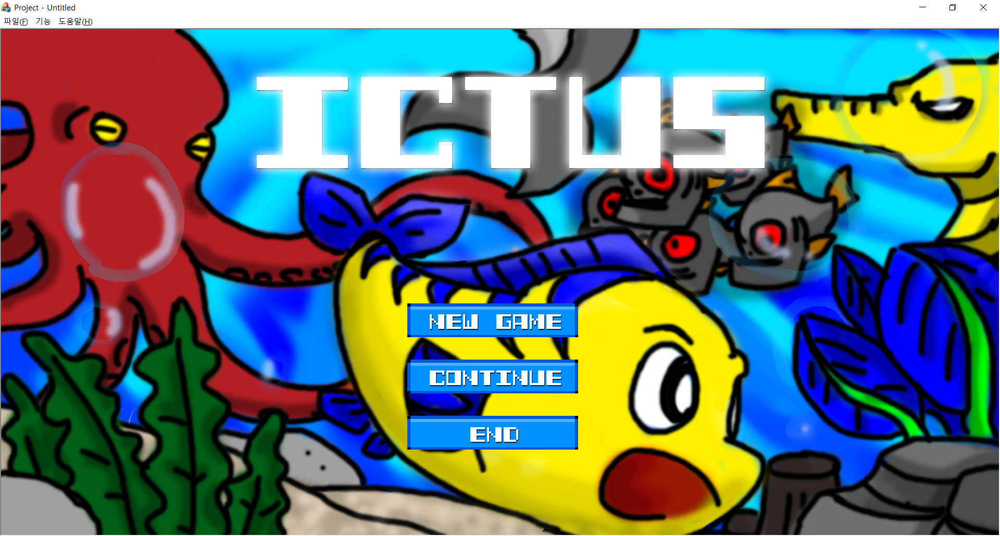
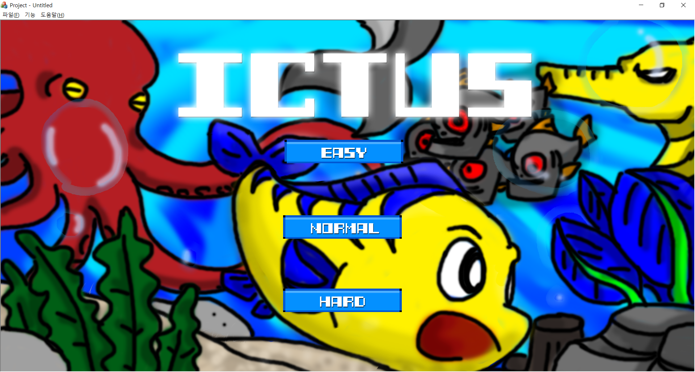
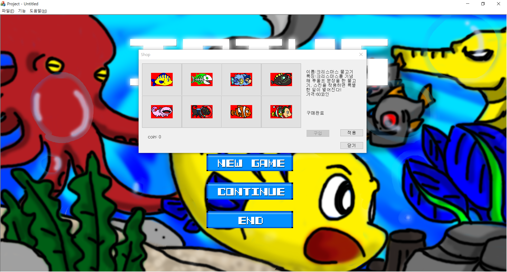
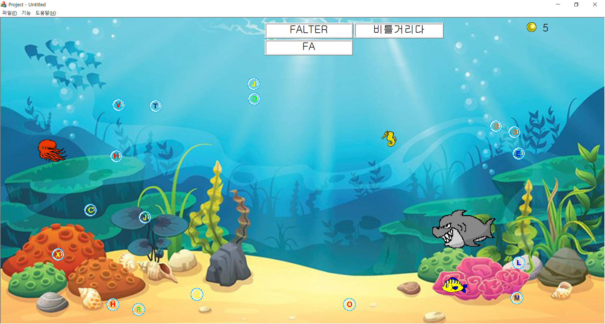
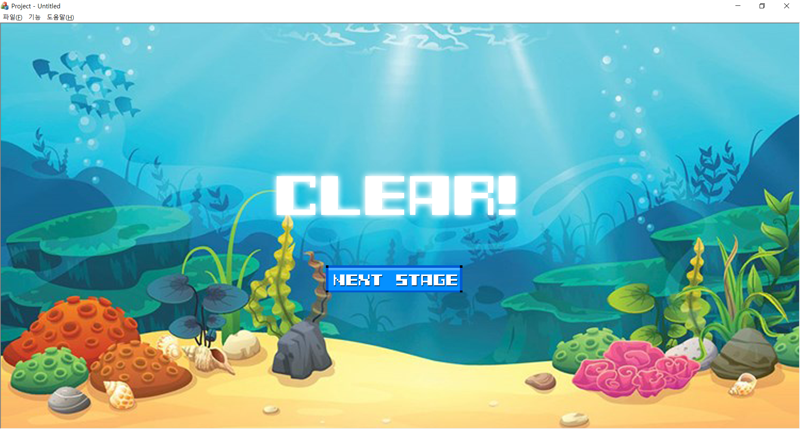

# Ictus (영어 단어 학습 게임)

 : **익투스는 두개의 곡선을 겹쳐 만든 물고기 모양의 상징으로, 물고기 키우기 게임에서 착안하여 영어 단어 학습의 즐거움을 주기 위한 게임입니다.**

### 정보

- 방향키로 물고기를 움직입니다.
- 화면 상단에 있는 영어단어 순서대로 알파벳 버블을 먹으세요!
- 순서대로 먹지 않으면 실패하며, 나타나는 적을 조심하세요!
- 단어를 수정하고 싶다면, 소스의 EasyList.txt, NormalList.txt, HardList.txt의 내용을 수정하세요

### 난이도

- Easy : 단어 난이도 쉬움, 문어, 해마 출현
- Normal : 단어 난이도 보통, 문어, 해마, 상어 출현
- Hard : 단어 난이도 어려움, 문어, 해마, 상어, 피라냐 출현

### 상점

: 게임속 코인을 모아 스킨을 구매하세요!

### 게임 스크린샷

---
### 개발 후기

- 기간 : 2017.09 ~ 2017.12
- 임무 : 게임 기획, 시스템 설계, 빌런(방해요소) 제작, 단어 txt파일을 불러와서 출력.
- 기술 : C++, MFC
